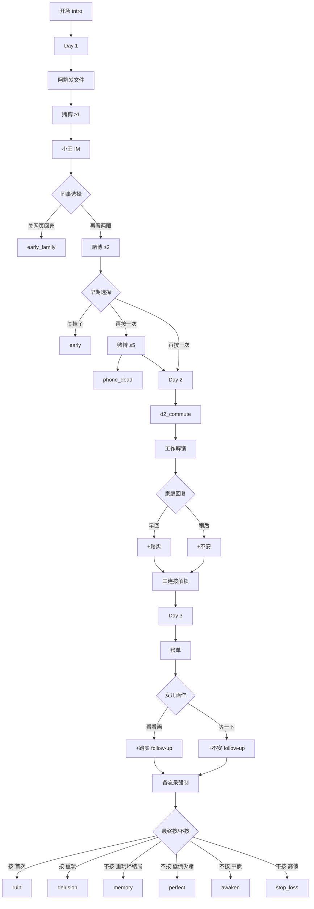

# 文案分支映射 — 别按那个键

> 源文件：`js/copy.js` · 逻辑：`js/events.js` · 结局判定：`handleFinalChoice`

---

## 分支总览

---

## 事件 ID → Copy Key → 结局

| 事件 ID | Copy 路径 | 触发条件 | 玩家选择 | 结果 |
|---------|-----------|----------|----------|------|
| `d1_subway` | `events.d1_subway` | Day1 首次 tick | — | 通知 |
| `d1_friend_msg` | `events.d1_friend_msg` | Day1 intro | 点击文件 | 打开赌博窗 |
| `d1_colleague` | `events.d1_colleague` | 赌≥1 | — | 聊天 + 链式弹窗 |
| `d1_colleague_choice` | `events.d1_colleague_choice` | 同事后 | 回家 / 再看 | `early_family` / 继续 |
| `d1_early_choice` | `events.d1_early_choice` | 赌≥2 | 关掉 / 再按 | `early` / 继续 |
| `d1_phone_dead` | `events.d1_phone_dead` | 赌≥5 Day1 | … | `phone_dead` |
| `d2_commute` | `events.d2_commute` | Day2 开始 | — | 通知 |
| `d2_work_notify` | `events.d2_work_notify` | Day2 | 工作 QTE | +现金 |
| `d2_family` | `events.d2_family` | AP≤2 或赌≥2 | 早回 / 稍后 | 见下表 |
| `d2_triple` | `events.d2_triple` | 瘾≥1 或赌≥3 | 三连按 | 赌×3 |
| `d2_deposit_hint` | `events.d2_deposit_hint` | 打开过赌博 | 存入 | 现金→virtual |
| `d3_bill` | `events.d3_bill` | Day3 | 知道了 | 压力 modal |
| `d3_drawing` | `events.d3_drawing` | AP≤2 或账单后 | 看画 / 等一下 | 见下表 |
| `d3_memo_force` | `events.d3_memo_force` | 画作已选 | 输入 memo | 必填 |
| `addiction_force` | `events.addiction_force` | 瘾≥3 Day2+ | …按 | 强制赌 |
| `anxiety_event` | `events.anxiety_event` | 不安≥3 Day2+ | … | 透支 modal |
| `final_choice` | `final.*` | memo+结束 Day3 | 按 / 不按 | 见结局表 |

---

## Day2 家庭回复分支

| 选择 ID | 按钮文案 (copy) | 玩家发送 | Follow-up | 数值 |
|---------|-----------------|----------|-----------|------|
| `good` | `events.d2_family.choices[0]` | `d2_family_good.player` | 小雅「汤热着」 | 踏实 +1 |
| `ignore` | `events.d2_family.choices[1]` | — | 小雅「……」 | 不安 +1 |

---

## Day3 女儿画作分支

| 选择 ID | 按钮文案 | 玩家发送 | Follow-up | 数值 |
|---------|----------|----------|-----------|------|
| `look` | `看看画` | `d3_drawing_look.player` | 朵朵+小雅暖线 | 踏实 +1 |
| `wait` | `等一下，在忙` | `d3_drawing_wait.player` | 朵朵「哦……」 | 不安 +1 |

---

## 结局映射

| 结局 ID | Copy 路径 | 条件 |
|---------|-----------|------|
| `early` | `endings.early` | Day1 早期弹窗选「关掉了」 |
| `early_family` | `endings.early_family` | Day1 同事弹窗选「关网页，回家陪家人」 |
| `phone_dead` | `endings.phone_dead` | Day1 赌≥5 且未早期止损 |
| `perfect` | `endings.perfect` | 最终不按 + 债务比<30% + 赌≤4 + 非重玩记忆 |
| `awaken` | `endings.awaken` | 最终不按 + 债务比<70% |
| `stop_loss` | `endings.stop_loss` | 最终不按 + 债务比≥70% |
| `ruin` | `endings.ruin` | 最终按（首次或无重玩记录） |
| `memory` | `endings.memory` | 重玩 + localStorage 有坏结局 + 最终不按 |
| `delusion` | `endings.delusion` | 重玩 + localStorage 有坏结局 + 最终按 |

---

## UI / 系统 Copy Key 索引

| 区域 | Copy 路径 |
|------|-----------|
| 开场 | `intro.*` |
| HUD / 按钮 | `buttons.*`, `hud.*` |
| 赌博反馈 | `gamble.*` |
| 工作 QTE | `work.*` |
| 心情 toast | `notify.mood*` |
| 结局统计 | `endingStats.*` |

---

## 维护说明

1. **改文案**：只改 `js/copy.js`，不改 `events.js` 业务逻辑  
2. **新分支**：在 `copy.js` 加 key → `events.js` 注册 handler → 更新本表  
3. **新结局**：`copy.js` endings + `handleFinalChoice` 条件 + 本表
